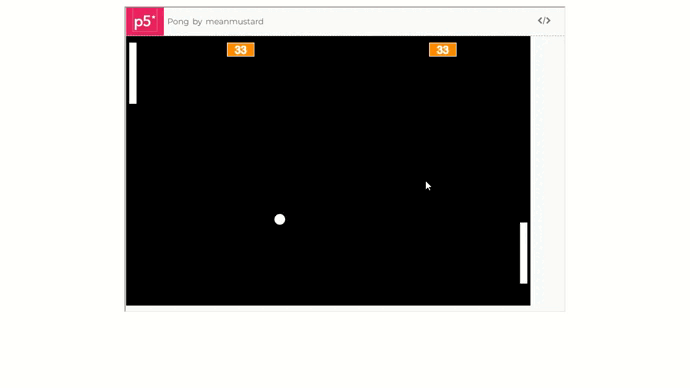

# JogoPongComJS

## Índice 

* [Introdução](#JogoPongComJS)
* [Descrição do Projeto](#descrição-do-projeto)
* [Funcionalidades e Demonstração da Aplicação](#funcionalidades-e-demonstração-da-aplicação)
* [Acesso ao Projeto](#acesso-ao-projeto)
* [Tecnologias utilizadas](#tecnologias-utilizadas)

## Descrição do Projeto

Este projeto consiste num jogo construído com Javascript e a biliblioteca p5.js, que é gratuita e open-source, desenvolvida para tornar a programação acessível para a criação artística. A ideia foi inspirada no game arcade 'Pong', do videogame Atari dos anos 70, criado por Allan Alcorn. O desenvolvimento foi feito tendo como base o curso de Lógica de Programação da plataforma Alura Cursos Online.

## Funcionalidades e Demonstração da Aplicação

O jogo pode ser controlado pelas teclas W e S que movem a raquete (respectivamente, cima e baixo) e possibilitam a colisão com a bola. O objetivo do jogo é aumentar a sua pontuação, e derrotar o computador. O placar é ilimitado, e o jogo inicia automaticamente no single-player. A versão multiplayer do projeto está em desenvolvimento.

A seguir, uma demonstração do game:

## Acesso ao projeto
<h3>Baixar</h3>

Para acessar o jogo, é preciso baixá-lo em seu computador: 
1. Entre no repositório do projeto PongJS  
2. Vá em Code (botão verde) 
3. Clique em Download ZIP 

Os arquivos serão baixados compactados, logo será necessário descompactar.

<h3>Jogar</h3>

 Para jogar, acesse o arquivo "index.html" no diretório baixado. O jogo será iniciado no seu navegador. Para controlar, dê um clique na tela.

## Tecnologias utilizadas
      

